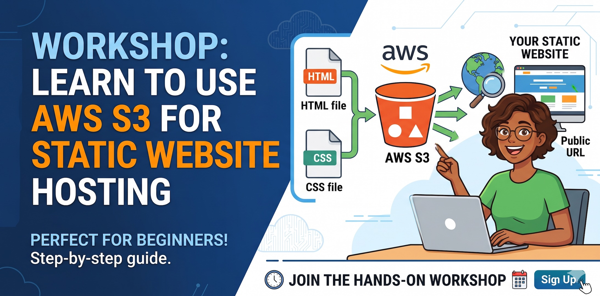
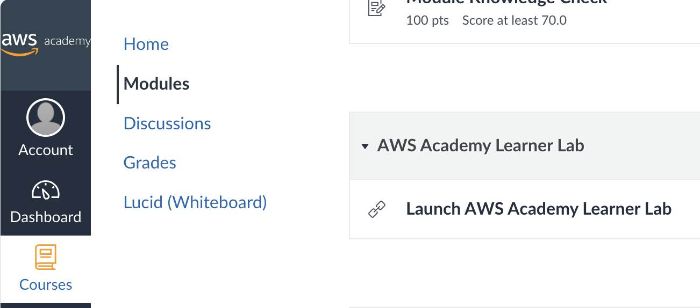
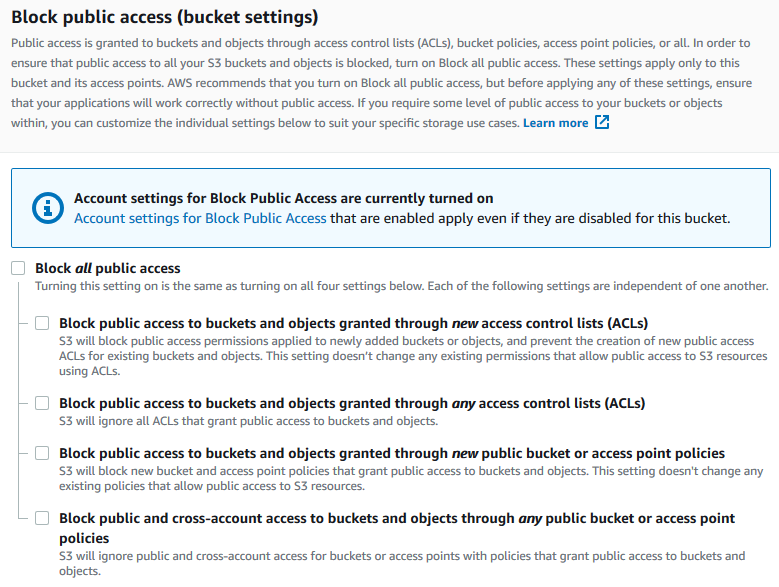

# Use AWS S3 for Static Web Hosting



This tutorial shows you how to use AWS S3 for static web hosting step-by-step. It covers creating an S3 bucket, configuring it for web hosting, uploading your website files, and making your site publicly accessible.

# Prerequisites

- Access to AWS Academy Learner Lab  
   In AWS Academy Learner Lab, choose module and choose **Launch AWS Academy Learner Lab**"  
  

- Have you website complete and ready in your personal computer.  
  A typical static website structure might look like this:

  ```
  your-website-root-folder/
  ├── index.html
  ├── css/
  │ └── styles.css
  ├── images/
  │ ├── logo.png
  │ ├── banner.jpg
  │ └── search-icon.svg
  └── js/
  └── main.js
  ```

---

# Sign in and open S3

1. Go to the AWS Management Console.
2. In the top search bar, type **“S3”** and select **Amazon S3**.

---

# Create the S3 bucket

1. Click **Create bucket**.
2. **Bucket name:**
   - Enter a globally unique name, e.g. `CourseCode-YourName-Website`.
3. **AWS Region:**
   - Choose a region close to your users (e.g. `Asia Pacific (Hong Kong)`).
4. **Object Ownership:**
   - Leave as default **Bucket owner preferred** (recommended).
5. **Block Public Access settings for this bucket:**
   - For simple S3-only hosting, **uncheck** _"Block all public access"_.
     
   - Confirm the warning by typing **confirm** when prompted.
6. Leave other settings as default (versioning, encryption, tags) unless you have specific needs.
7. Click **Create bucket**.

---

# Upload your website files

1. Click the name of your new bucket.
2. Go to the **Objects** tab.
3. Click **Upload** → **Add files**.
4. Select your `index.html` and other assets (CSS, JS, images).
5. Click **Upload** and wait until the status shows **Upload succeeded**.

---

# Enable static website hosting on the bucket

1. Inside the bucket, go to the **Properties** tab.
2. Scroll down to **Static website hosting**.
3. Click **Edit**.
4. Under **Static website hosting**, choose **Enable**.
5. **Hosting type:** select **Host a static website**.
6. **Index document:**
   - Enter `index.html` (or your main file name).
7. **Error document (optional but recommended):**
   - Enter `error.html` if you have one.
8. Click **Save changes**.

You’ll now see a **Bucket website endpoint** URL (e.g. `http://CourseCode-YourName-Website.s3-website-ap-southeast-1.amazonaws.com`). Keep this for testing.

---

# Configure bucket policy for public read access

1. Go to the **Permissions** tab of the bucket.
2. Scroll to **Bucket policy** and click **Edit**.
3. Paste a policy like this, replacing `YOUR-BUCKET-NAME` with your actual bucket name. Don't accidentaly delete any other part such as the ending`/*`.

   ```json
   {
     "Version": "2012-10-17",
     "Statement": [
       {
         "Sid": "PublicReadGetObject",
         "Effect": "Allow",
         "Principal": "*",
         "Action": "s3:GetObject",
         "Resource": "arn:aws:s3:::YOUR-BUCKET-NAME/*"
       }
     ]
   }
   ```

# Test your static website

1. Go back to the Properties tab.
2. Copy the Bucket website endpoint URL.
3. Paste it into your browser.
4. You should see your index.html page load as a website.
